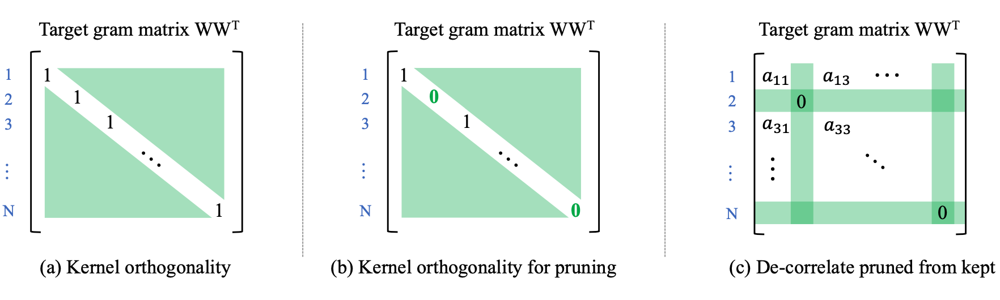
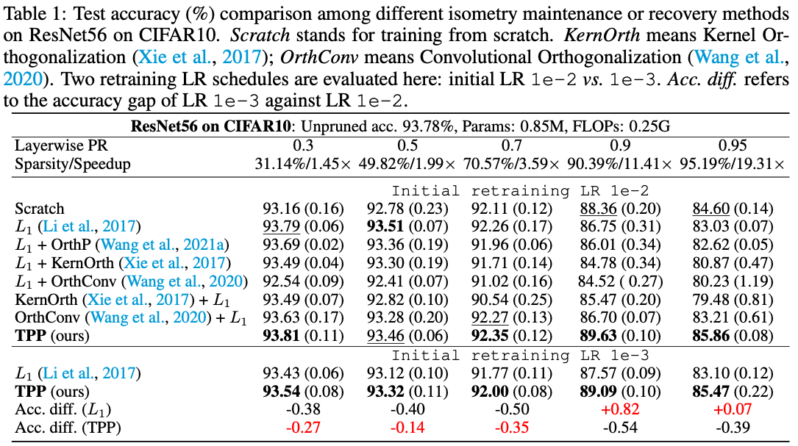
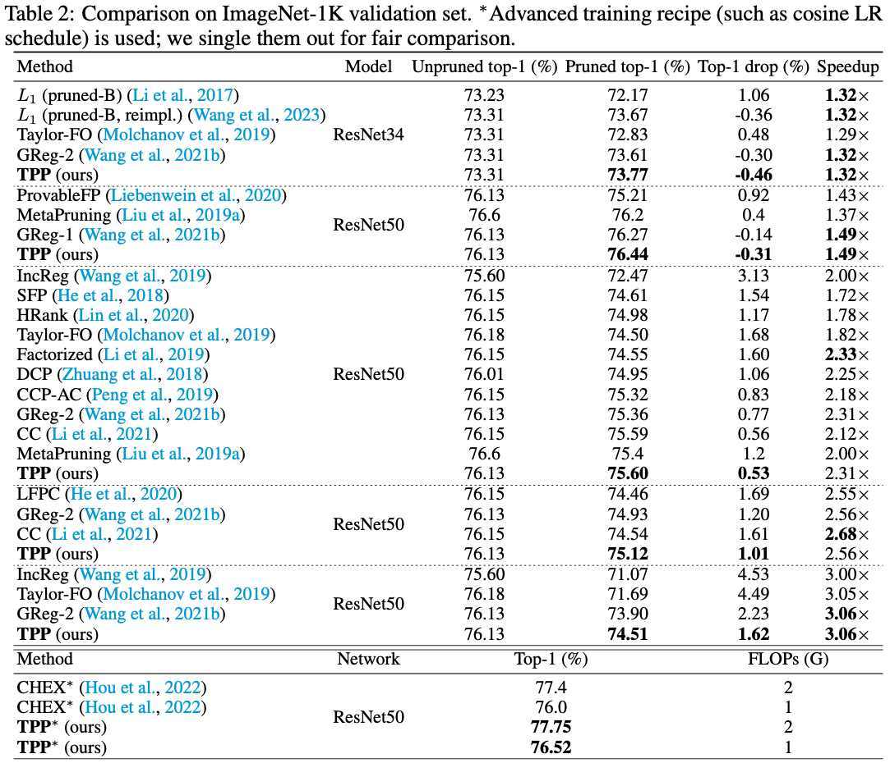

# TPP (Trainability Preserving Pruning) ICLR 2023

### [ArXiv](https://arxiv.org/abs/2207.12534) | [PDF](https://arxiv.org/pdf/2207.12534.pdf) 

<div align="center">
    <a></a>
    &nbsp &nbsp
    <a></a>
</div>

This repository is for a new structured network pruning method (`Trainability Preserving Pruning, TPP`) for efficient deep learning, introduced in our ICLR'23 paper:
> **Trainability Preserving Neural Pruning** \
> [Huan Wang](http://huanwang.tech/), [Yun Fu](http://www1.ece.neu.edu/~yunfu/) \
> Northeastern University, Boston, MA, USA


## Abstract
<div align="center">
  
</div>
<justify>
Many recent works have shown trainability plays a central role in neural network pruning – unattended broken trainability can lead to severe under-performance and unintentionally amplify the effect of retraining learning rate, resulting in bi- ased (or even misinterpreted) benchmark results. This paper introduces trainabil- ity preserving pruning (TPP), a scalable method to preserve network trainability against pruning, aiming for improved pruning performance and being more robust to retraining hyper-parameters (e.g., learning rate). Specifically, we propose to penalize the gram matrix of convolutional filters to decorrelate the pruned filters from the retained filters. In addition to the convolutional layers, per the spirit of preserving the trainability of the whole network, we also propose to regularize the batch normalization parameters (scale and bias). Empirical studies on linear MLP networks show that TPP can perform on par with the oracle trainability recovery scheme. On nonlinear ConvNets (ResNet56/VGG19) on CIFAR10/100, TPP outperforms the other counterpart approaches by an obvious margin. Moreover, results on ImageNet-1K with ResNets suggest that TPP consistently performs more favorably against other top-performing structured pruning approaches.
</justify>

## Install
```
conda create --name tpp python=3.9.6
conda activate tpp
cd <code root>
pip install -r requirements.txt  # we use pytorch 1.9.0
```

## Reproducing our results
### Tab. 1 & Tab. 10 (ResNet56 on CIFAR10 & VGG19 on CIFAR100)

1. Download pretrained ResNet56 and VGG19 ckpts.

```bash
sh scripts/download_pretrained_ckpts.sh
```
It will save to folder `pretrained_ckpts`.

2. Run the following snippets. Here we use pruning ratio 0.9 as an example. You may change it to 0.1 ~ 0.95 to reproduce our results in Tabs. 1 and 10.

```bash
# TPP (ours)
CUDA_VISIBLE_DEVICES=0 python main.py --prune_method opp -a resnet56 --lr_ft 0:0.01,60:0.001,90:0.0001 --epochs 120 --pretrained_ckpt pretrained_ckpts/resnet56_cifar10.pth --dataset cifar10 --wd 0.0005 --batch_size 128 --batch_size_prune 128 --index_layer name_matching --stage_pr *layer*.conv1:0.9 --update_reg_interval 10 --stabilize 10000 --opp_scheme 5 --lw_opp 1000  --experiment_name TPP__resnet56__cifar10__pr0.9__lrft0.01
```


### Tab. 2 (ResNets on ImageNet)

```bash

# ResNet34, 1.32x

# ResNet50, 1.49x

# ResNet50, 2.31x

# ResNet50, 2.56x

# ResNet50, 3.06x
```

For the results with TIMM in Tab. 2, we apply our method to the [TIMM code base](https://github.com/huggingface/pytorch-image-models), which needs more time to clean up now. Stay tuned. Thanks!


## Experimental Results

1. ResNet56 on CIFAR10
On this small dataset, we attempt to show TPP beats other alternative trainability-preserving methods. Five baseline approaches are compared to.

<div align="center">
  
</div>


2. ResNets on ImageNet
On imagenet, following standard filter pruning papers, we compare different methods at the same (or similar) speedups (measured by FLOPs reduction).

<div align="center">
  
</div>


> If you have noted that the proposed method TPP seems to "only beat others marginally" at the presented speedups, it is recommended to check out our [another paper](https://arxiv.org/abs/2301.05219) for a demystified overview of the status quo of filter pruning.

## Acknowledgments
In this code we refer to the following implementations: [Regularization-Pruning](https://github.com/MingSun-Tse/Regularization-Pruning), [pytorch imagenet example](https://github.com/pytorch/examples/tree/master/imagenet), [rethinking-network-pruning](https://github.com/Eric-mingjie/rethinking-network-pruning), [EigenDamage-Pytorch](https://github.com/alecwangcq/EigenDamage-Pytorch), [pytorch_resnet_cifar10](https://github.com/akamaster/pytorch_resnet_cifar10). Great thanks to them!
