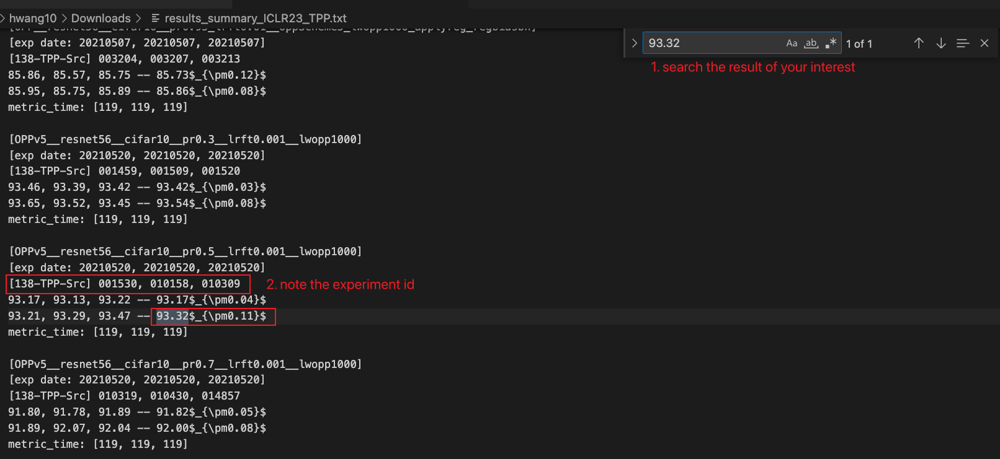

# TPP (Trainability Preserving Pruning) ICLR 2023

[](https://arxiv.org/abs/2207.12534)
[](https://arxiv.org/pdf/2207.12534.pdf)
[](https://mingsun-tse.github.io/files/Wang_and_Fu_ICLR23_TPP.pdf)
[](https://github.com/MingSun-Tse/TPP/releases/tag/v0.1)
[](https://github.com/MingSun-Tse/TPP)

<div align="center">
    <a></a>
    &nbsp &nbsp
    <a></a>
</div>

This repository is for a new structured network pruning method (`Trainability Preserving Pruning, TPP`) for efficient deep learning, introduced in our ICLR'23 paper:
> **Trainability Preserving Neural Pruning** \
> [Huan Wang](http://huanwang.tech/), [Yun Fu](http://www1.ece.neu.edu/~yunfu/) \
> Northeastern University, Boston, MA, USA


## Introduction
<div align="center">
  
</div>

<details open>
<summary>Abstract</summary>
<p align="justify">
Many recent works have shown trainability plays a central role in neural network pruning – unattended broken trainability can lead to severe under-performance and unintentionally amplify the effect of retraining learning rate, resulting in bi- ased (or even misinterpreted) benchmark results. This paper introduces trainability preserving pruning (TPP), a scalable method to preserve network trainability against pruning, aiming for improved pruning performance and being more robust to retraining hyper-parameters (e.g., learning rate). Specifically, we propose to penalize the gram matrix of convolutional filters to decorrelate the pruned filters from the retained filters, as shown in the figure (c) above. In addition to the convolutional layers, per the spirit of preserving the trainability of the whole network, we also propose to regularize the batch normalization parameters (scale and bias). Empirical studies on linear MLP networks show that TPP can perform on par with the oracle trainability recovery scheme. On nonlinear ConvNets (ResNet56/VGG19) on CIFAR10/100, TPP outperforms the other counterpart approaches by an obvious margin. Moreover, results on ImageNet-1K with ResNets suggest that TPP consistently performs more favorably against other top-performing structured pruning approaches.
</p>
</details>


## Install
```
conda create --name tpp python=3.9.6
conda activate tpp
cd <code root>
pip install -r requirements.txt  # we use pytorch 1.9.0
```

## Reproducing our results
### Tab. 1 & Tab. 10 (ResNet56 on CIFAR10 & VGG19 on CIFAR100)

1. Download pretrained ResNet56 and VGG19 ckpts.

```bash
sh scripts/download_pretrained_ckpts.sh
```
It will save to folder `pretrained_ckpts`.

2. Run the following snippets. Here we use pruning ratio 0.9 as an example. You may change it to 0.1 ~ 0.95 to reproduce our results in Tabs. 1 and 10.

```bash
# TPP, resnet56
python main.py \
-a resnet56 --dataset cifar10 \
--wd 0.0005 --batch_size 128 --batch_size_prune 128 \
--lr_ft 0:0.01,60:0.001,90:0.0001 --epochs 120 --pretrained_ckpt pretrained_ckpts/resnet56_cifar10.pth \
--prune_method opp --opp_scheme 5 --lw_opp 1000 --update_reg_interval 10 --stabilize_reg_interval 10000 \
--index_layer name_matching --stage_pr *layer*.conv1:0.9 \
--experiment_name TPP__resnet56__cifar10__pr0.9__lrft0.01

# TPP, vgg19
python main.py \
-a vgg19_C --dataset cifar100 \
--wd 0.0005 --batch_size 256 --batch_size_prune 256 \
--lr_ft 0:0.01,60:0.001,90:0.0001 --epochs 120 --pretrained_ckpt pretrained_ckpts/vgg19_cifar100.pth \
--prune_method opp --opp_scheme 5 --lw_opp 1000 --update_reg_interval 10 --stabilize_reg_interval 10000 \
--index_layer name_matching --stage_pr *features*:0.9 --skip_layers *features.0 \
--experiment_name TPP__vgg19__cifar100__pr0.9__lrft0.01
```


### Tab. 2 (ResNets on ImageNet)

For the ImageNet experiments, we use torchvision models as the base model. They will be automatically downloaded during training.

```bash
# ResNet50, 2.31x
python main.py --prune_method opp --opp_scheme v5 --lw_opp 1000 --update_reg_interval 5 --stabilize_reg_interval 40000 --dataset imagenet -a resnet50 --pretrained --lr_ft 0:0.01,30:0.001,60:0.0001,75:0.00001 --epochs 90 --batch_size_prune 256 --batch_size 256 --index_layer name_matching --stage_pr *layer[1-3]*conv[1-2]:0.6,*layer4*conv[1-2]:0.21 --experiment_name TPP__resnet50__imagenet__2.31x_PR0.60.21 -j 32

# ResNet50, 2.56x
python main.py --prune_method opp --opp_scheme v5 --lw_opp 1000 --update_reg_interval 5 --stabilize_reg_interval 40000 --dataset imagenet -a resnet50 --pretrained --lr_ft 0:0.01,30:0.001,60:0.0001,75:0.00001 --epochs 90 --batch_size_prune 256 --batch_size 256 --index_layer name_matching --stage_pr *layer[1-2]*conv[1-2]:0.74,*layer3*conv[1-2]:0.6,*layer4*conv[1-2]:0.21 --experiment_name TPP__resnet50__imagenet__2.56x_PR0.740.60.21 -j 32

# ResNet50, 3.06x
python main.py --prune_method opp --opp_scheme v5 --lw_opp 1000 --update_reg_interval 5 --stabilize_reg_interval 40000 --dataset imagenet -a resnet50 --pretrained --lr_ft 0:0.01,30:0.001,60:0.0001,75:0.00001 --epochs 90 --batch_size_prune 256 --batch_size 256 --index_layer name_matching --stage_pr *layer[1-3]*conv[1-2]:0.68,*layer4*conv[1-2]:0.5 --experiment_name TPP__resnet50__imagenet__3.06x_PR0.680.5 -j 32
```
> For the results with TIMM in Tab. 2, we apply our method to the [TIMM code base](https://github.com/huggingface/pytorch-image-models), which needs more time to clean up. Stay tuned. Thanks!


## Experimental Results

1. **ResNet56 on CIFAR10**

On this small dataset, we attempt to show TPP beats other alternative trainability-preserving methods. Five baseline approaches are compared to.

<div align="center">
  
</div>


2. **ResNets on ImageNet**

On imagenet, following standard filter pruning papers, we compare different methods at the same (or similar) speedups (measured by FLOPs reduction).

<div align="center">
  
</div>


> If you have noted that the proposed method TPP seems to "only beat others marginally" at the presented speedups, it is recommended to check out our [another paper](https://arxiv.org/abs/2301.05219) for a demystified overview of the status quo of filter pruning.


## Logs/Ckpts Release and Tips to Reproduce
Normally, you should be able to reproduce the results using the provided scripts above. If you want to check the log associated with a specific number in our paper, here is a step-by-step guidance:

0. Download the [released](https://github.com/MingSun-Tse/TPP/releases/tag/v0.1) experiment logs and results summary:
```
wget https://github.com/MingSun-Tse/TPP/releases/download/v0.1/results_summary_ICLR23_TPP.txt
wget https://github.com/MingSun-Tse/TPP/releases/download/v0.1/logs_ICLR23_TPP.zip
unzip logs_ICLR23_TPP.zip  # This will unzip to a folder "Experiments_Released"
```

1. Say you are interested in the result `93.32 (0.11)` by our method in Tab. 1 (PR 0.5 and initial learning rate 1e-3). Then you can search in the released results summary txt. Note the *6-digit numbers*, which are called *[experiment ids](https://github.com/MingSun-Tse/smilelogging)*.

<div align="center">
  
</div>

2. When you have the experiment ids, e.g., 001530, it is very easy to track down the associated logs via 
```
ls Experiments_Released | grep 001530
```
On my computer, this gives me
```
ls Experiments_Released | grep 001530
OPPv5__resnet56__cifar10__pr0.5__lrft0.001__lwopp1000_SERVER115-20210520-001530/
```
The log txt is at the path `log/log.txt` under this folder. The log txt documents *everything* you need to reproduce the result (e.g., git commit ID and the script), thanks to [smilelogging](https://github.com/MingSun-Tse/smilelogging).

Currently, we only release a few [ckpts](https://github.com/MingSun-Tse/TPP/releases/tag/v0.1) (those on ImageNet as they are the most weight-carrying experiments). Others are omitted because they consume too much of the GitHub space. This said, if you want them anyway, welcome to drop me a line (wang.huan@northeastern.edu). Enjoy!


## Acknowledgments

In this code we refer to the following implementations: [Regularization-Pruning](https://github.com/MingSun-Tse/Regularization-Pruning), [pytorch imagenet example](https://github.com/pytorch/examples/tree/master/imagenet), [rethinking-network-pruning](https://github.com/Eric-mingjie/rethinking-network-pruning), [EigenDamage-Pytorch](https://github.com/alecwangcq/EigenDamage-Pytorch), [pytorch_resnet_cifar10](https://github.com/akamaster/pytorch_resnet_cifar10), [TIMM](https://github.com/huggingface/pytorch-image-models). Great thanks to them!

We sincerely thank all the [reviewers in ICLR'23](https://openreview.net/forum?id=AZFvpnnewr) for helping us improve this paper!

## Citation

If this paper or code helps you, please generously consider citing our paper:

```
@inproceedings{wang2023trainability,
    title = {Trainability Preserving Neural Pruning},
    author = {Wang, Huan and Fu, Yun},
    booktitle = {ICLR},
    year = {2023},
}
```

